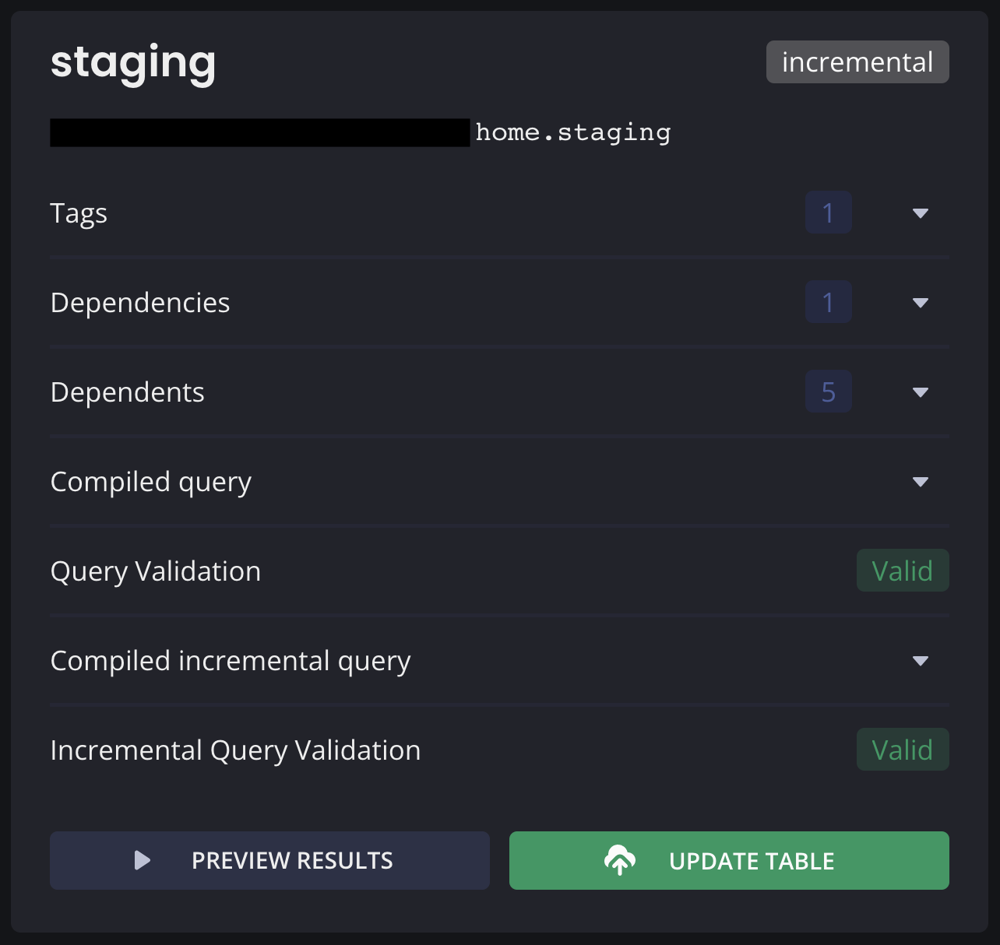

1. <a href="#camada-de-dados">Camada de dados</a>
2. <a href="#criacao-tabelas-operations">Criação de tabelas e operations</a>
3. <a href="#funcoes-sql">Funções SQL</a>
4. <a href="#schedules">Schedules</a>
5. <a href="#monitoramento">Monitoramento</a>

<a name="camada-de-dados"></a>

# Camadas de dados

Dentro do Dataform todos os componentes foram separados em camadas, para facilitar o gerenciamento das queries e o reaproveitamento dos dados. De modo geral temos 3 tipos de camadas:

* Sources
* Staging
* Analytics

## Sources
Nesta camada é onde ficam armazenados os arquivos de configuração das fontes de dados, ou seja, sempre que for preciso adicionar uma nova fonte de dados por exemplo uma tabela, é aqui onde será armazenado o arquivo de referência a ela.

Para saber como criar um arquivo de declaração de tabela, você pode acessar [este link](https://docs.dataform.co/best-practices/start-your-dataform-project#define-your-source-data-with-declarations).

Aqui temos apenas uma declaração de tabela referente a tabela `my-bq-table` do projeto RAW.


## Staging
Nesta camada é onde ficam armazenados os dados _raw_ (sem tratamento). A ideia de termos essa camada fisicamente no BigQuery, é para que sempre que for preciso construir alguma visão em cima dos dados, seja utilizada essa camada. Isso evita a necessidade de ir até o projeto RAW e consultar a tabela `my-bq-table` diretamente, deixando o processo mais lento e custoso levando em consideração a quantidade de dados que existem lá.

Aqui temos apenas uma tabela chamada `staging`.



## Analytics
Nesta camada é onde ficam armazenados os dados já tratados e agrupados, prontos para serem consumidos pelo Looker. As tabelas dessa camada devem puxar os dados da camada anterior.

Aqui temos 3 tabelas diferentes listadas a seguir:

### Realtime
Essa tabela contém os dados principais que são utilizados diretamente no Looker.


### Historical
Essa tabela é um reflexo da tabela `realtime`, porém é particionada e armazenada por um período maior.


<a name="criacao-tabelas-operations"></a>

# Criação de tabelas e operations
As tabelas e operations são criados automaticamente por 2 arquivos que estão localizados em suas respectivas camadas:


## Arquivos de configurações
Para criar novas tabelas e/ou operations é necessário adicionar as configurações dessa tabela/operation em alguns arquivos, são eles:

* includes/tableConfigurations.js
* includes/queryVars.js
* includes/queries.js

### tableConfigurations.js
Neste arquivo é onde são armazenadas as configurações de cada tabela/operation, foram criadas 4 variáveis principais que salvam essas configurações.


Para criar a tabela/operation, basta adicionar o `JSON` de configuração dela a sua respectiva variável.

* stagingTables: Configs das tabelas na camada **Staging**;
* analyticsTables: Configs das tabelas na camada **Analytics**;
* stagingOperations: Configs dos operations na camada **Staging**;
* analyticsOperations: Configs dos operations na camada **Analytics**.

Ou seja, para criar uma **tabela** na camada **Staging**, é só adicionar o `JSON` de configuração da tabela na variável `stagingTables`, e assim por diante.

Para saber mais sobre quais configurações são possíveis de adicionar ao seu `JSON`, você pode acessar [este link](https://docs.dataform.co/reference#ITableConfig).

### queryVars.js
Neste arquivo é onde são armazenadas as variáveis e referências a outras tabelas que podem ser utilizadas nas queries. Aqui também foi criada a mesma lógica de uma variável para cada camada.


Para criar as variáveis que serão utilizadas nas queries, basta adicionar um map onde a chave deve **obrigatoriamente** ser o nome da tabela, e o valor deve ser um `JSON` contendo essas variáveis num formato de `chave: valor`, como mostra o exemplo acima.

Obs: Todo `JSON` de variáveis **deve** conter uma variável chamada `refs` que é uma lista de nomes de tabela que serão referenciadas na query, mesmo que essa variável seja **vazia** (ex: `refs: ['staging']`, `refs: []`).

* stagingVars: Variáveis das queries de tabelas na camada **Staging**;
* analyticsVars: Variáveis das queries de tabelas na camada **Analytics**;
* stagingOpVars: Variáveis das queries de operations na camada **Staging**;
* analyticsOpVars: Variáveis das queries de operations na camada **Analytics**.

Você pode criar variáveis de qualquer nome aqui dentro e conseguirá chamá-las de dentro das queries utilizando `${vars['my_var']}`, por exemplo:

```js
const stagingVars = {
  staging: {
    refs: ["common_event_0_1_2"],
    scanRange: 0,
    maxDate: "2022-06-08"
  }
};
```

Sendo que, `staging` é obrigatoriamente o nome da tabela, e possui 3 variáveis: 

* Referência para tabela `common_event_0_1_2`;
* Uma variável chamada `scanRange` com valor de `0`;
* Uma variável chamada `maxDate` com valor de `"2022-06-08"`.

Para utilizá-las dentro das queries, você irá referenciá-las como:

* `${vars['ref-common_event_0_1_2']}`
* `${vars['scanRange']}`
* `${vars['maxDate']}`

Lembrando que todas as referências de tabelas **devem** ser chamadas com o prefixo `ref-` seguido do nome da tabela.

### queries.js
Neste arquivo é onde são armazenadas as queries que gerarão as tabelas/operations, aqui dentro será necessário criar uma função que retorne a query desejada. Para auxiliar nisso, foram criadas algumas funções para mapear as funções deste arquivo com os arquivos `operations.js` e `tables.js`.

Getters para retornar as funções que contém as queries. Sendo que, funções referentes a tabela devem possuir os parâmetros `ctx` e `vars`, e funções referentes a operations devem possuir apenas o parâmetro `vars`.


Funções que mapeiam o nome da tabela com o nome da função que será criada para retornar a query:


* stagingQueries: Mapeamento entre o nome da tabela e sua função na camada **Staging**;
* analyticsQueries: Mapeamento entre o nome da tabela e sua função na camada **Analytics**;
* stagingOpQueries: Mapeamento entre o nome do operation e sua função na camada **Staging**;
* analyticsOpQueries: Mapeamento entre o nome do operation e sua função na camada **Analytics**.

Então, para conseguir criar uma tabela na camada Staging por exemplo, é preciso criar uma função que retorne sua query, e adicionar o mapeamento entre o nome dessa função e o nome da tabela nas variáveis acima.

Exemplo completo criando uma tabela simples na camada **analytics**, que referencia a tabela `staging` e utiliza uma variável chamada `my_var`:

Arquivo `tableConfiguration.js`
```js
const analyticsTables = [
  {
    ...
  },
  {
    name: "my_table",
    schema: "home",
    type: "table"
  }
];
```

Arquivo `queryVars.js`
```js
const analyticsVars = {
  realtime: {
    ...
  },
  my_table: {
    refs: ["staging"],
    my_var: 1
  }
};
```

Arquivo `queries.js`
```js
var analyticsQueries = {
  realtime,
  ...,
  my_table: myQuery
};

function myQuery(ctx, vars) {
  return `
  SELECT 
    *
  FROM ${vars["ref-staging"]}
  WHERE 2 = ${vars["my_var"]}`
}
```

E com isso pode-se observar no arquivo `definitions/analytics/tables.js`, que a tabela `my_table` já aparece para ser criada no BigQuery.


<a name="funcoes-sql"></a>

## Funções SQL
Dentro da pasta `/includes` foram adicionados alguns outros arquivos `.js`, dentro destes arquivos ficam armazenadas algumas funções que exportam transformações em SQL. Elas podem ser reutilizadas dentro das queries para facilitar o reaproveitamento de código em campos que possuem transfomações iguais.


Um exemplo seria o arquivo `extract_detalhamento.js`, que contém a seguinte função:

```js
module.exports = (eventAction) => {
  return `CASE 
    WHEN ${eventAction} LIKE "%|%" 
      THEN LOWER(SPLIT(${eventAction}, '|')[OFFSET(1)]) 
    ELSE "" 
  END`;
}
```

E para utilizar essa função dentro da query, podemos chamá-la da seguinte forma dentro do arquivo `queries.js`:

```js
...
SELECT
  ${extract_detalhamento('eventAction')} AS my_column
FROM
...
```

<a name="schedules"></a>

## Schedules
Para a parte de schedules foram criados 4 agendamentos, conforme a imagem abaixo:


* weekly_job: Configurado para rodar toda segunda-feira às 6:00 AM (UTC), ele roda todas as operations de reprocessamento semanais (D-7).
* set_partition_expiration: Configurado para rodar toda segunda-feira às 6:00 AM (UTC), ele roda as queries que configuram a expiração das partições de todas as tabelas.
* realtime_monitoring: Configurado para rodar a cada 5 minutos, ele roda a query de monitoramento de linhas da tabela `realtime`.
* historical_daily: Configurado para rodar todos os dias às 6:00 AM (UTC), ele roda as queries que geram a tabela `historical_avg_minute` e atualizam a tabela `historical`.

<a name="monitoramento"></a>

## Monitoramento

O monitoramento é feito a partir de um job chamado `realtime_monitoring` no próprio Dataform, que coleta a quantidade de linhas totais da tabela `realtime` e salva essa informação em uma outra tabela de controle chamada `realtime_rows`. Com isso temos um tracking da quantidade de linhas e é feito uma consulta nessa tabela junto com o job, que verifica se a quantidade de linhas aumentou em relação aos últimos 35 minutos. Caso o Dataform detecte que a quantidade não aumentou, é disparado um alerta para o Slack do time de Big Data.

> **Obs:** Essa parte de monitoramento foi implementada dessa forma por algumas restrições, porém não precisamos seguir essa parte, o recomendado é realizar o monitoramento por fora do Dataform.